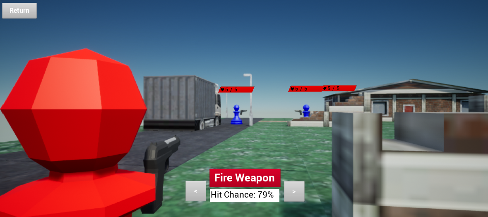

# XClone
## About

XClone is a squad shooter that is turn based and features grid movement (think Xcom).
## Features
 * Custom grid based movement
   * For this project I decided to create my own pathfinding system using the A* algorithm rather than Unreal's built in one
   * 
 * Cover and Shooting system
   * Hiding in cover decreases your chances of getting hit
   * 
 * PVP Multiplayer
   * For this project I learned and implemented Unreal's replication system to allow LAN PVP
   * 
